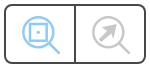
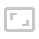
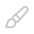
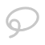

# Image Viewer

The Image Viewer is Piximi's annotator. Use it to inspect your **multichannel** and **multiplane** images, adjust how they are displayed, and create, edit, filter and export annotations.

To open it, select one or more images (or objects) in the [Project Viewer](projectviewer.md) and click **Image Viewer** at the top of the grid. If you selected objects, the images they belong to are loaded and the objects are highlighted.

## Overview

 
 

1. **Drawer Tabs**: Switch the drawer between the **Images | Channels** and **Annotations** panels. The arrow at the top returns to the Project Viewer, and the app controls (settings, feedback, help) are pinned to the bottom.
2. **Drawer**: The panel selected in the drawer tabs.
3. **Zoom & Position Tools**: Control how the image is zoomed and positioned in the canvas.
4. **Canvas**: The image and its annotations.
5. **Image Info Strip**: Cursor position, pixel values, and per-image settings.
6. **Tools**: Select, measure, and create annotations.

## Images | Channels Drawer

 
 

1. **Image List**: The images loaded in the viewer. Click an image to show it in the canvas. Use the menu button on an image to export or clear the annotations for that image.
2. **Channels**: One row per channel of the active image. Use the check box to show or hide a channel, and the settings button to adjust the channel's brightness and contrast range (min and max values), its color, and to view its histogram.

## Annotations Drawer

 
 

1. **Plane Scope**: For multiplane images, choose whether the panel (counts, filters, and actions) applies to the **Current Plane** or the **Whole Stack**.
2. **Filters**: Build a non-destructive filter from the categories, kinds, and object features selected below. Choose whether matching objects are **kept** or **hidden**, then click **Create Filter** (or **Update Filter** to merge the current selection into an existing filter).
3. **Object Features**: Narrow the filter using measured object properties.
4. **Kinds & Categories**: Every kind in the project and its categories, with the number of annotations in view.
   - Click **Add Kind** to create a new kind, or **Add category** to add a category to a kind.
   - Use the check boxes to select all the annotations of a kind or category. **Select all** selects everything in view.
   - Each row has a menu for editing or deleting the kind or category.
5. **Selection Actions**: Shows how many annotations are selected (**Clear** deselects them), and acts on them:
   - **Delete** -- delete annotations from the selection, the current view, the current plane, or the whole image.
   - **Categorize** -- change the category of the annotations in the chosen scope.
   - **Export** -- export annotations in the chosen scope (see below).

### Exporting Annotations

Choose the scope of the export (selected annotations, those in view, the current plane, or the whole image) and a format:

- Piximi-formatted JSON (annotations exported in this format can be imported back into Piximi)
- COCO-formatted JSON
- Labeled or Binary Instance Masks
- Labeled or Binary Semantic Masks
- Label Matrices

Mask images are exported in the `.tiff` file format.

## Canvas

The selected image is shown in the canvas, with its annotations overlaid in the color of their category.

- **Zoom**: Scroll to zoom.
- **Pan**: Hold `alt`/`option` and drag.

The **Image Info Strip** along the bottom of the canvas shows:

- **x, y**: The position of the cursor on the image.
- **Pixel Color**: The value of each channel at the cursor position.
- **Timepoint** and **Plane**: For multiplane images, a slider to move through the planes.
- **Image Category**: The category of the whole image. Select a category from the list, or create a new one.

## Zoom & Position Tools

These sit at the top of the viewer:

-  **Zoom Center**: Choose whether scroll zooming is centered on the image or on the cursor.
-  **Actual Size**: Show the image at its original size.
-  **Fit Screen**: Resize the image so it fits the canvas.
-  **Reset Position**: Move the image back to the origin and reset the zoom.

## Tools

 
 

The toolbar on the right of the canvas has two groups of tools. Each tool also has a keyboard shortcut, shown in its tooltip.

**1. Utility Tools**

-  **Selection Tool** (`shift` + `S`): Click an annotation to select it. Hold `shift` while clicking, or click and drag, to select several. Selected annotations can be resized and moved.
-  **Measure Tool** (`shift` + `D`): Click and drag to measure a distance on the image.

**2. Annotation Creation Tools**

-  **Rectangle** (`shift` + `R`): Click and drag, or click twice, to create a rectangular annotation.
-  **Ellipse** (`shift` + `E`): Click and drag, or click twice, to create an elliptical annotation.
-  **Polygon** (`shift` + `P`): Click to place each vertex, then click on or near the first vertex to finish.
-  **Pen** (`shift` + `F`): Draw an annotation freehand. Open the slider to set the pen size.
-  **Lasso** (`shift` + `L`): Click and drag to draw a boundary around the object.
-  **Magnetic** (`shift` + `M`): Snaps to the edges of objects to speed up annotating.
-  **Color / Fill** (`shift` + `C`): Click an object to annotate the connected region of similar color.
-  **Quick Annotation** (`shift` + `Q`): Predicts an annotation near the cursor. Use the slider to adjust the sensitivity.
-  **Threshold** (`shift` + `T`): Select a region in which to generate annotations. Use the slider to adjust the sensitivity. _Note: the generated mask is treated as a single annotation._

## Confirming and Editing Annotations

When you finish drawing a shape it is not saved right away. A small toolbar appears at the bottom of the canvas so you can decide what to do with it.

 
 

1. **Confirm** (`enter`): Save the annotation. A kind must be selected or created first.
2. **Add as New Annotation**: Save the shape as a separate annotation.
3. **Combine**: Merge the shape into the annotation(s) it overlaps.
4. **Subtract**: Remove the shape from the annotation(s) it overlaps.
5. **Intersection**: Keep only the region where the shape and an existing annotation overlap.
6. **Cancel** (`esc`): Discard the shape.

To see the tools in action go to the  section.
