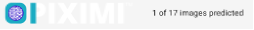

# Tutorial Inicial de Piximi (ESPAÑOL)

> **Segmentación y clasificación sin instalación en el navegador**
>
> Beth Cimini, Le Liu, Esteban Miglietta, Paula Llanos, Nodar Gogoberidze
>
> Instituto Broad del MIT y Harvard, Cambridge, MA.

### **Información general:**

#### **¿Qué es Piximi?**

Piximi es una herramienta moderna de análisis de imágenes tomando ventaja de varios métodos de _deep learning_, sin requerir conocimientos de programación. Implementado como una aplicación web en [https://piximi.app/](https://piximi.app/), Piximi no requiere instalación y se puede acceder desde cualquier navegador web moderno. Su arquitectura de cliente único preserva la seguridad de los datos del investigador ejecutando todos los cálculos localmente\*.

Piximi es interoperable con herramientas y flujos de trabajo existentes, ya que admite la importación y exportación formatos de datos y modelos comunes. La interfaz intuitiva y el fácil acceso a Piximi permiten a los biólogos obtener información sobre las imágenes en tan sólo unos minutos. Piximi tiene como objetivo llevar el análisis de imágenes basado en _deep learning_ a una comunidad más amplia mediante la eliminación de las barreras de entrada.

\* excepto las segmentaciones mediante Cellpose, que se envían a un servidor remoto (con el permiso del usuario).

Funciones básicas: **Anotador, Segmentador, Clasificador, Mediciones.**

#### **Objetivo del ejercicio**

En este ejercicio, se familiarizará con las principales funcionalidades de Piximi de anotación, segmentación, clasificación, medición y visualización y lo utilizará para analizar un conjunto de imágenes de muestra de un experimento de translocación. El objetivo de este experimento es determinar la **dosis efectiva más baja** de Wortmannin requerida para inducir la localización nuclear de FOXO1A etiquetada con GFP (Figura 31). Segmentará las imágenes utilizando uno de los modelos de _deep learning_ disponibles en Piximi. Comprobará y curará la segmentación y luego entrenará un clasificador de imágenes para clasificar las células individuales como teniendo «GFP nuclear», «GFP citoplasmática» o «sin GFP». Por último, realizará mediciones y las representará gráficamente para responder a la pregunta biológica.

#### **Contexto del experimento de muestra**

En este experimento, los investigadores tomaron imágenes de células U2OS de osteosarcoma (cáncer de hueso) fijadas que expresaban una proteína de fusión FOXO1A-GFP y tiñeron con DAPI para marcar los núcleos. FOXO1 es un factor de transcripción que desempeña un papel clave en la regulación de la gluconeogénesis y la glicogenólisis a través de la señalización de insulina. FOXO1A se desplaza dinámicamente entre el citoplasma y el núcleo en respuesta a diversos estímulos. Wortmannin, un inhibidor de PI3K, puede bloquear la exportación nuclear, lo que resulta en la acumulación de FOXO1A en el núcleo.

_Representación esquemática del mecanismo de acción de FOXO1A._

#### **Materiales necesarios para este ejercicio**

Los materiales necesarios para este ejercicio pueden descargarse de: [PiximiTutorial](./downloads/Piximi_Translocation_Tutorial_RGB.zip). El archivo «Piximi Translocation Tutorial RGB.zip» contiene un proyecto de Piximi que incluye todas las imágenes, ya etiquetadas con el tratamiento correspondiente (concentración de Wortmannin o Control). ¡Descargue este archivo pero **NO lo descomprima**!

#### **Instrucciones para el ejercicio**

Lea los pasos que se indican a continuación y siga las instrucciones donde se indican. Los pasos en los que debe averiguar una solución están marcados con 🔴 PARA HACER.

##### 1. **Cargar el proyecto Piximi**

🔴 PARA HACER

- Inicia Piximi en:[https://piximi.app/](https://piximi.app/)

- Cargar el proyecto de ejemplo: Haga clic en «Abrir» \- “Proyecto” \- «Proyecto desde Zip», como se muestra en la figura 32 para cargar un archivo de proyecto para este tutorial desde Zip, y opcionalmente puede cambiar el nombre del proyecto en el panel superior izquierdo, como «Ejercicio Piximi». A medida que se carga, se puede ver la progresión en la esquina superior izquierda logotipo .

_Cargando el archivo de proyecto._

##### 2. **Compruebe las imágenes cargadas y explore la interfaz Piximi**

_Visualización de las imágenes del proyecto._

Estas 17 imágenes representan tratamientos con Wortmannin a ocho concentraciones diferentes (expresadas en nM), así como tratamientos con sólo vehículo (0nM). Observe que el canal DAPI (Núcleos) se muestra en magenta y que el canal GFP (FOXOA1) se muestra en verde.

Al pasar el cursor por encima de la imagen, aparecen etiquetas de color en la esquina izquierda de las imágenes. Estas anotaciones proceden de los metadatos del archivo comprimido que acabamos de cargar. En este tutorial, las etiquetas de diferentes colores indican la concentración de Wortmannin, mientras que los números representan el número de imágenes en cada categoría.

Opcionalmente, puede anotar las imágenes manualmente haciendo clic en «+ Category», introduciendo su etiqueta, y luego seleccionando la imagen haciendo clic en las imágenes anotando las imágenes seleccionadas haciendo clic en **«Categorize»**. En este tutorial, nos saltaremos este paso ya que las etiquetas ya estaban cargadas al principio. Puede encontrar más información en la sección [Visor de proyectos](../detail/projectviewer.md) de los documentos.

##### 3. **Segmentar Células - diferenciar las células del _background_**.

🔴 PARA HACER

- Para iniciar la predicción en todas las imágenes, haga clic en «Seleccionar todas las imágenes» en el panel superior.

 
 

- Cambie la Tarea de Aprendizaje a «SEGMENTATION».

 
 

- Haga clic en «+ LOAD MODEL» y aparecerá una ventana que le permitirá elegir un modelo pre-entrenado.

 
 

- Para el ejercicio de hoy, seleccione «Cellpose». Puede encontrar más información sobre el modelo admitido [aquí](https://documentation.piximi.app/segmentation.html). Haga clic en «Open Segmentation Modeln» para cargar su modelo y seleccionarlo.

 
 

- Por último, haga clic en «Predict model». Verá el progreso de la predicción en la esquina superior izquierda debajo del logo de Piximi. Tardará unos minutos en finalizar la segmentación.

 
 

Tenga en cuenta que los pasos anteriores se realizaron en su computadora local, lo que significa que sus imágenes se almacenan localmente. Sin embargo, la inferencia de Cellpose se ejecuta en la nube, lo que significa que sus imágenes se cargarán para su procesamiento. Si sus imágenes son altamente sensibles, por favor tenga cuidado cuando utilice servicios basados en la nube.

##### 4. **Visualice el resultado de la segmentación y corrija los errores de segmentación**

🔴 PARA HACER

- Haga clic en la pestaña **CELLPOSE_CELLS** para comprobar las células individuales que se han segmentado. Seleccione algunos objetos identificados o imágenes completas, luego haga clic en "Anotar" en la barra superior para verlos en el Visor de imágenes.

_Visualización de las imágenes del proyecto en el Visor de imágenes._

- Opcionalmente, aquí puede refinar manualmente la segmentación utilizando las herramientas del anotador. El anotador de Piximi ofrece varias opciones para **añadir**, **restar** o **interseccionar** anotaciones. Además, la **herramienta de selección** le permite **redimensionar** o **eliminar** anotaciones específicas. Para empezar a editar, seleccione imágenes específicas, o todas las imágenes, haciendo clic en la casilla de verificación de la parte superior.
- Opcionalmente, puede ajustar los canales: Aunque hay dos canales en este experimento, la señal de los núcleos se duplicó en los canales rojo y verde. Este diseño está pensado para ser **color-blind friendly** y para producir un **color magenta** para los núcleos. El **canal verde** también incluye señales citoplasmáticas.

Otra razón para duplicar los canales es que algunos modelos (como **Cellpose** que usamos hoy) requieren que las imágenes de entrada tengan **tres canales**.

- Puede optar por segmentar manualmente las células para generar máscaras para los datos de 'verdad de referencia' (_ground truth_).

##### 5. **Clasificar células**

Razón para hacer esto: Queremos clasificar las “CELLPOSE_CELLS” basándonos en la distribución de la GFP (en Núcleos, citoplasma, o sin GFP) sin etiquetarlas todas y cada una manualmente. Para ello, podemos utilizar la función de clasificación en Piximi, que nos permite entrenar un clasificador utilizando un pequeño subconjunto de datos etiquetados y luego clasificar automáticamente las células restantes.

🔴 PARA HACER

- Ir a la pestaña **CELLPOSE_CELLS** que muestra los objetos segmentados.

_Visualización del tipo «cellpose_cells»._

- Hacer clic en la pestaña **Clasificación** del panel izquierdo.

_Sección de clasificadores de Action Drawer._

- Cree nuevas categorías haciendo clic en «+ Category». Añadir «Cytoplasmatic_GFP», «Nuclear_GFP», «No_GFP» tres categorías.

_Botón Crear categoría._

- Haga clic en las imágenes que coincidan con sus criterios. Puede seleccionar varias células manteniendo pulsado al tecla **Comamnd (⌘)** en Mac o **Shift** en Linux. Intenta asignar **~20-40 células por categoría**. Una vez seleccionadas, haz clic en **«Categorize»** para asignar las etiquetas a las células seleccionadas.

_Clasificando células individuales en base a la presencia de GFP y su localización._

##### 6. **Entrenar el modelo clasificador**

🔴 PARA HACER

- Haz clic en el icono « - Fit Model» para abrir la configuración de los hiperparámetros del modelo. Para el ejercicio de hoy, ajustaremos algunos parámetros:
- Haga clic en «Architecture Settings» y ajuste la _Model Architecture_ a **SimpleCNN**.
- Actualice las dimensiones de entrada a

  - Filas de entrada: 48
  - Columnas de entrada: 48
  - Canales: 3 (ya que nuestras imágenes están en formato RGB)

  (Puede cambiar a otros números como 64, 128)

- En la sección “Particionado de datos”, establezca el porcentaje de entrenamiento (_training percentage_) en 0,75, que reserva el 25% de los datos etiquetados para la validación.

_Configuración del modelo clasificador._

- Cuando haga clic en "**Fit Classifier**" en Piximi, aparecerán dos gráficos de entrenamiento "**Precisión vs Épocas**" y "**Pérdida vs Épocas**". Cada gráfico muestra curvas para datos de **entrenamiento** y **validación**.

_Gráficos del historial de entrenamiento._

- En el gráfico de **precisión**, verás lo bien que está aprendiendo el modelo. Lo ideal es que tanto la precisión de entrenamiento como la de validación aumenten y se mantengan cercanas.
- En el gráfico de pérdidas, los valores más bajos significan un mejor rendimiento. Si la pérdida de validación empieza a aumentar mientras la pérdida de entrenamiento sigue cayendo, el modelo podría estar sobreajustándose.

Estos gráficos le ayudan a comprender cómo está aprendiendo el modelo y si es necesario realizar ajustes.

##### 7. **Evaluar el modelo:**

🔴 PARA HACER

_Evaluación de la ejecución de entrenamiento._

- Haga clic en **«Predict model»** para aplicar el modelo que acabamos de entrenar. Este paso generará predicciones en las células que no hemos anotado.

_Predecir clasificador._

- Puede revisar las predicciones en la pestaña CELLPOSE_CELLS y eliminar cualquier categoría mal asignada.
- Opcionalmente, puede seguir utilizando las etiquetas para refinar la verdad de referencia (_ground truth_) y mejorar el clasificador. Este proceso es parte de la clasificación **Human-in-the-loop**, donde se corrige iterativamente y entrenar el modelo basado en la entrada humana.
- Haga clic en **«Evaluate model»** para evaluar el modelo que acabamos de entrenar. Las métricas de confusión y de evaluación pueden compararse con la verdad de referencia (_ground truth_).
- Haga clic en «Accept Prediction (Hold)» (deberás mantener presionado el cursor unos segundos), para asignar las etiquetas predichas a todos los objetos.

_Aceptar predicciones._

##### 8. **Medición**

Una vez que esté satisfecho con la clasificación, procederemos a medir los objetos. El objetivo del ejercicio de hoy es determinar la concentración mínima de Wortmannin necesaria para bloquear la exportación de FOXO1A-GFP desde los núcleos. Para ello, podemos medir la intensidad total de GFP a nivel de imagen o a nivel de objeto.

🔴 PARA HACER

- Haga clic en «Measurement» en la esquina superior derecha.

_Navegar a Medidas._

- Haga clic en "**+**" junto a «**Tables**», seleccione «**Image**» y haga clic en «**Confirm**». _Nota: La preparación de los datos para la medición puede tardar un tiempo_.

_Crear tabla de medidas "**Image**"._

- Haga clic en «Category» para incluir todas las categorías en la medición.
- En «Total», haga clic en «Channell 1» para seleccionar la medición para GFP. Verá la medición en la pestaña «DATA GRID». Las mediciones se presentan como valores medios o medianos, y el conjunto de datos completo está disponible al exportar el archivo `.csv`.

_Medidas calculadas._

##### 9. **Visualización**

Después de generar las mediciones, puede trazar las mediciones.

🔴 PARA HACER

- Haga clic en “**PLOTS**” para visualizar las mediciones.

_Parcelas de medición._

- Establezca el tipo de trazado en “**Swarm**” y elija un tema de color basado en su preferencia.
- Seleccione “**Y-axis**” como “**intensity-total-channel-1**” y establezca “**SwarmGroup**” como “**category**”; esto generará una curva mostrando cómo varía la intensidad de GFP a través de diferentes categorías.
- Seleccionando “**Show Statistics**” se mostrará la media, así como los límites de confianza superior e inferior, en el gráfico.
- Opcionalmente, puede experimentar con diferentes tipos de gráficos y ejes para ver si los datos revelan información adicional.

_Graficar los resultados._

##### 10. **Exportar los resultados y guardar el proyecto**

🔴 PARA HACER

- Haz clic en «SAVE» en la esquina superior izquierda para guardar todo el proyecto. Verás la animación del logo de Piximi a medida que avanza el guardado .

##### 11. **Información adicional**

Consulta el paper de Piximi: [https://www.biorxiv.org/content/10.1101/2024.06.03.597232v2](https://www.biorxiv.org/content/10.1101/2024.06.03.597232v2)

Consulta la documentación de Piximi:[Documentación de Piximi](https://documentation.piximi.app/intro.html):[https://documentation.piximi.app/intro.html](https://documentation.piximi.app/intro.html)

Informar de fallos/errores o solicitar características [https://github.com/piximi/documentation/issues](https://github.com/piximi/documentation/issues)
