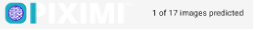

# Tutorial Inicial de Piximi (ESPAÑOL)

> **Segmentación y clasificación sin instalación en el navegador**
>
> Beth Cimini, Le Liu, Esteban Miglietta, Paula Llanos, Nodar Gogoberidze
>
> Instituto Broad del MIT y Harvard, Cambridge, MA.

### **Información general:**

#### **¿Qué es Piximi?**

Piximi es una herramienta moderna de análisis de imágenes que toma ventaja de varios métodos de _deep learning_, sin requerir conocimientos de programación. Implementado como una aplicación web en [https://piximi.app/](https://piximi.app/), Piximi no requiere instalación y se puede acceder a ella desde cualquier navegador web moderno. Su arquitectura de cliente único preserva la seguridad de los datos del investigador ejecutando todos los cálculos localmente.

Piximi es interoperable con herramientas y flujos de trabajo existentes, ya que admite la importación y exportación de formatos de datos y modelos comunes. La interfaz intuitiva y el fácil acceso a Piximi permiten a los biólogos obtener información sobre las imágenes en tan sólo unos minutos. Piximi tiene como objetivo llevar el análisis de imágenes basado en _deep learning_ a una comunidad más amplia mediante la eliminación de las barreras de entrada.

Funciones básicas: **Anotador, Segmentador, Clasificador, Mediciones.**

#### **Objetivo del ejercicio**

En este ejercicio, se familiarizarás con las principales funcionalidades de Piximi de anotación, segmentación, clasificación, medición y visualización y las utilizarás para analizar un conjunto de imágenes de muestra de un experimento de translocación. El objetivo de este experimento es determinar la **dosis efectiva más baja** de Wortmannin requerida para inducir la localización nuclear de FOXO1A etiquetada con GFP (Figura 31). Segmentarás las imágenes utilizando uno de los modelos de _deep learning_ disponibles en Piximi. Comprobarás y curarás la segmentación y luego entrenarás un clasificador de imágenes para clasificar las células individuales como según presenten `GFP nuclear`, `GFP citoplasmática` o `sin GFP`. Por último, realizarás mediciones y las representarás gráficamente para responder a la pregunta biológica.

#### **Contexto del experimento de ejemplo**

En este experimento, los investigadores tomaron imágenes de células U2OS de osteosarcoma (cáncer de hueso) fijadas que expresaban una proteína de fusión FOXO1A-GFP y tiñeron con DAPI para marcar los núcleos. FOXO1A es un factor de transcripción que desempeña un papel clave en la regulación de la gluconeogénesis y la glicogenólisis a través de la señalización de insulina. FOXO1A se desplaza dinámicamente entre el citoplasma y el núcleo en respuesta a diversos estímulos. Wortmannin, un inhibidor de PI3K, puede bloquear la exportación nuclear, lo que resulta en la acumulación de FOXO1A en el núcleo.


```{div} tutorial-caption
Representación esquemática del mecanismo de acción de FOXO1A.
```

#### **Materiales necesarios para este ejercicio**

No es necesario descargar nada: las imágenes están incluidas en Piximi como un proyecto de ejemplo llamado **Translocation Tutorial**. Dicho proyecto ontiene todas las imágenes, ya etiquetadas con el tratamiento correspondiente (concentración de Wortmannin o Control).

#### **Instrucciones para el ejercicio**

Lee los pasos que se indican a continuación y sigue las instrucciones donde se indican. Los pasos en los que debes averiguar una solución están marcados con 🔴 PARA HACER.

##### 1. **Cargar el proyecto Piximi**

🔴 PARA HACER

- Inicia Piximi en:[https://piximi.app/](https://piximi.app/)

- Carga el proyecto de ejemplo: En la pantalla de inicio, haga clic en `Open Example Project` y selecciona `Translocation Tutorial`. Si ya tienes un proyecto abierto, puedes llegar a la misma lista a través de `Open` > `Project` > `Load Example`. Opcionalmente puedes cambiar el nombre del proyecto en el panel superior izquierdo, como `Ejercicio Piximi`. A medida que se carga el proyecto, se puede ver la progresión en la esquina superior izquierda logotipo .


```{div} tutorial-caption
Cargando el proyecto de ejemplo Translocation Tutorial.
```


##### 2. **Comprueba las imágenes cargadas y explore la interfaz Piximi**


```{div} tutorial-caption
Visualización de las imágenes del proyecto.
```


Estas 17 imágenes representan tratamientos con Wortmannin a diez concentraciones diferentes (expresadas en nM), así como tratamientos con sólo vehículo (0 nM). Observe que el canal DAPI (Núcleos) se muestra en magenta y que el canal GFP (FOXOA1) se muestra en verde.

Las etiquetas de color en la esquina superior izquierda de cada imagen, y la lista `Categories` de la izquierda, proceden de los metadatos guardados con el proyecto de ejemplo. En este tutorial, las etiquetas de diferentes colores indican la concentración de Wortmannin, mientras que los números de la lista representan el número de imágenes en cada categoría.

Opcionalmente, puede etiquetar las imágenes manualmente haciendo clic en el icono `+` (New Category) junto a `Categories` e introduciendo un nombre, y luego seleccionando imágenes en la cuadrícula y haciendo clic en el icono `Categorize` situado encima para asignar una categoría. En este tutorial, nos saltaremos este paso ya que las etiquetas ya forman parte del proyecto. Puedes encontrar más información en la sección [Visor de proyectos](../detail/projectviewer.md) de los documentos.

##### 3. **Segmentar Células - diferenciar las células del _background_**.

🔴 PARA HACER

- Para iniciar la predicción en todas las imágenes, haz clic en el icono `Select all` situado encima de las imágenes.


```{div} tutorial-caption
Seleccionando todas las imágenes.
```

- En la sección `Learning Task`, cambie la tarea a `Segmentation`.


```{div} tutorial-caption
Cambiando la tarea a `Segmentation`.
```

- Haz clic en `Select Model` y aparecerá la ventana `Load Segmentation Model`, que te permite elegir un modelo pre-entrenado.


```{div} tutorial-caption
La ventana `Load Segmentation Model`.
```

- Para el ejercicio de hoy, selecciona `Cellpose-SAM` de la lista `Pre-trained Models`. Puedes encontrar más información sobre los modelos admitidos [aquí](./segmentation-tutorial.md#2-load-models). Haz clic en `Load Model` para cargar su modelo y seleccionarlo. El modelo se ejecuta en tu navegador, por lo que la primera vez descarga los archivos del modelo (Cellpose-SAM ocupa unos 588 MB y requiere un navegador compatible con WebGPU).


```{div} tutorial-caption
Eligiendo `Cellpose-SAM` de la lista `Pre-trained Models`.
```

- Por último, haz clic en `Run Segmentation`. Los objetos segmentados se añadirán al proyecto como un nuevo tipo (_kind_), con el nombre indicado en `Output kind name` (`cellpose_cells` por defecto). Piximi muestra el progreso de la segmentación mientras se ejecuta.


```{div} tutorial-caption
Ejecutando la segmentación.
```

Ten en cuenta que los pasos anteriores se realizaron en tu computadora local, lo que significa que tus imágenes se almacenan localmente. La inferencia de Cellpose-SAM también se ejecuta localmente en tu navegador, por lo que tus imágenes nunca se cargan.

##### 4. **Visualiza el resultado de la segmentación y corrije los errores de segmentación**

🔴 PARA HACER

- Haz clic en `Annotations` encima de la cuadrícula de imágenes y luego en la pestaña **cellpose_cells** para comprobar las células individuales que se han segmentado.


```{div} tutorial-caption
Visualización del tipo `cellpose_cells`.
```


- Selecciona algunos objetos identificados o imágenes completas, luego haz clic en `Image Viewer` en la barra superior para verlos en el Visor de Imágenes.


```{div} tutorial-caption
Visualización de las células segmentadas en el Visor de Imágenes.
```


- Opcionalmente, aquí puedes refinar manualmente la segmentación utilizando las herramientas del anotador. El anotador de Piximi ofrece varias opciones para **añadir**, **restar** o **interseccionar** anotaciones. Además, la **herramienta de selección** te permite **redimensionar** o **eliminar** anotaciones específicas. Para empezar a editar, selecciona imágenes específicas, o todas las imágenes, haciendo clic en la casilla de verificación de la parte superior.
- Opcionalmente, puedes ajustar los canales: Aunque hay dos canales en este experimento, la señal de los núcleos se duplicó en los canales rojo y verde. Este diseño está pensado para ser **accesible a daltonismo** (_color-blind friendly_) y para producir un **color magenta** para los núcleos. El **canal verde** también incluye señales citoplasmáticas.

Otra razón para duplicar los canales es que algunos modelos (como **Cellpose** que usamos hoy) requieren que las imágenes de entrada tengan **tres canales**.

- Puedes optar por segmentar manualmente las células para generar máscaras para la 'verdad de referencia' (_ground truth_).

##### 5. **Clasificar células**

Razón para hacer esto: Queremos clasificar las “cellpose_cells” basándonos en la distribución de la GFP (en Núcleos, citoplasma, o sin GFP) sin etiquetarlas todas y cada una manualmente. Para ello, podemos utilizar la función de clasificación en Piximi, que nos permite entrenar un clasificador utilizando un pequeño subconjunto de datos etiquetados y luego clasificar automáticamente las células restantes.

🔴 PARA HACER

- Ir a la pestaña **cellpose_cells** (en la vista `Annotations`) que muestra los objetos segmentados, y hacer clic en el botón `Classification` de la sección `Learning Task` del panel izquierdo. Las categorías que aparecen a la izquierda pertenecen ahora a las células y no a las imágenes.

````{div} fig-float fig-wrap


```{div} tutorial-caption
La sección de clasificación del panel izquierdo.
```
````

- Crea nuevas categorías haciendo clic en el icono `+` (_New Category_) junto a `Categories`, introduciendo un nombre en la ventana `Create Category` y haciendo clic en `Confirm`. Añadir tres categorías: `GFP_Cytoplasmatico`, `GFP_Nucleae`, `Sin_GFP`.


```{div} tutorial-caption
Creando una categoría.
```


- Haz clic en las células que coincidan con sus criterios; cada clic añade una célula a la selección (utiliza el icono  `Deselect` para empezar de nuevo). Intenta asignar **~20-40 células por categoría**. Una vez seleccionadas, haz clic en el icono  `Categorize` situado encima de las células y elige la categoría para asignarla a las células seleccionadas.


```{div} tutorial-caption
Clasificando células individuales en base a la presencia de GFP y su localización.
```


##### 6. **Entrenar el modelo clasificador**

🔴 PARA HACER

- Haz clic en `Fit` en la sección `Learning Task` para abrir la ventana `Fit Model` con la configuración del modelo (pestaña `Hyperparameters`). Para el ejercicio de hoy, ajustaremos algunos parámetros:
- Comprueba que la `Model Architecture` esté establecida en **Simple CNN** (el valor por defecto).
- En `Data Preprocessing Settings` > `Image Augmentation`, actualiza el `Input Shape` a:

  - Row: 48
  - Col: 48
  - Ch.: 3 (ya que nuestras imágenes están en formato RGB)

  (Puedes cambiar a otros números como 64, 128)

- En la sección `Data Partitioning`, establece el `Training Percentage` (porcentaje de entrenamiento) en 0,75, que reserva el 25% de los datos etiquetados para la validación.


```{div} tutorial-caption
Configuración del modelo clasificador.
```


- Cuando hagas clic en `Fit Classifier` en Piximi, la ventana cambia a la pestaña `Training Plots`, donde aparecen dos gráficos de entrenamiento "**Precisión por Epoch**" y "**Pérdida por Epoch**". Cada gráfico muestra curvas para datos de **entrenamiento** y **validación**.


```{div} tutorial-caption
Gráficos del historial de entrenamiento.
```


- En el gráfico de **precisión**, verás lo bien que está aprendiendo el modelo. Lo ideal es que tanto la precisión de entrenamiento como la de validación aumenten y se mantengan cercanas.
- En el gráfico de **pérdida**, los valores más bajos significan un mejor rendimiento. Si la pérdida de validación empieza a aumentar mientras la pérdida de entrenamiento sigue cayendo, el modelo podría estar sobreajustándose.

Estos gráficos le ayudan a comprender cómo está aprendiendo el modelo y si es necesario realizar ajustes. Cierra la ventana `Fit Model` con el icono  de su esquina superior derecha cuando hayas terminado.

##### 7. **Evaluar el modelo:**

🔴 PARA HACER

- Haz clic en  `Evaluate` para evaluar el modelo que acabamos de entrenar. La matriz de confusión y las métricas de evaluación comparan las predicciones del modelo sobre las células de validación con sus etiquetas de verdad de referencia (_ground truth_).


```{div} tutorial-caption
Evaluación de la ejecución de entrenamiento.
```


- Haz clic en  `Predict` para aplicar el modelo que acabamos de entrenar. Este paso generará predicciones en las células que no hemos categorizado.


```{div} tutorial-caption
Predecir clasificador.
```


- Puedes revisar las predicciones en la pestaña **cellpose_cells**. Las categorías predichas solo se muestran, no se aplican, hasta que las aceptes, y `Clear Predictions` las descarta.
- Opcionalmente, puedes seguir categorizando células para refinar la verdad de referencia (_ground truth_) y mejorar el clasificador, y luego volver a entrenar y predecir. Este proceso es parte de la clasificación **Human-in-the-loop**, donde se corrige iterativamente y entrenar el modelo basado en la entrada humana.
- Haz clic y mantén presionado  `Accept Predictions (Hold)` para asignar las etiquetas predichas a todos los objetos.


```{div} tutorial-caption
Aceptar predicciones.
```


##### 8. **Medición**

Una vez que estés satisfecho con la clasificación, procederemos a medir los objetos. El objetivo del ejercicio de hoy es determinar la concentración mínima de Wortmannin necesaria para bloquear la exportación de FOXO1A-GFP desde los núcleos. Para ello, podemos medir la intensidad total de GFP a nivel de imagen o a nivel de objeto. Aquí medimos las imágenes, que tienen la concentración de Wortmannin como categoría.

🔴 PARA HACER

- Haz clic en `Measure` en la barra superior del Visor de proyectos.


```{div} tutorial-caption
Navegar a Medidas.
```


- Haz clic en `Add Table`, mantenga `Images` como tipo (_kind_) y haz clic en `Confirm`. _Nota: La preparación de los datos para la medición puede tardar un tiempo_.


```{div} tutorial-caption
Crear tabla de medidas `Images`.
```


- En el panel izquierdo, despliega `Intensity` > `Total` y marca `Channel-1` para seleccionar la medición para GFP. Verás la medición en la tabla de datos.
- En `Split Options`, arrastra `Category` desde `Available Dimensions` hasta `Column Grouping` para mostrar las mediciones de cada categoría (aquí, cada concentración de Wortmannin). La tabla muestra `Count`, `Mean`, `Median` y `Std Dev` de cada medición, y el conjunto de datos completo está disponible al exportar el archivo `.csv`.


```{div} tutorial-caption
Medidas calculadas.
```


##### 9. **Visualización**

Después de generar las mediciones, puedes graficar las mediciones.

🔴 PARA HACER

- Haz clic en `Plot View` encima de la tabla para visualizar las mediciones.


```{div} tutorial-caption
Tabla de mediciones.
```


- Establece `Plot` en “**Swarm**” y elije el `Color Theme` que prefieras.
- Selecciona `Y-axis` como “**total-Channel-1**” y establece “**SwarmGroup**” como “**category**”; esto mostrará cómo varía la intensidad de GFP a través de diferentes categorías.
- Seleccionando `Show Statistics` se superpondrán diagramas de caja sobre los enjambres (_swarms_), mostrando la mediana, los cuartiles superior e inferior, y el mínimo y el máximo de cada categoría.
- Opcionalmente, puedes experimentar con diferentes tipos de gráficos y ejes para ver si los datos revelan información adicional.


```{div} tutorial-caption
Gráfico de enjambre (_swarm_) de la intensidad total de GFP por categoría.
```


##### 10. **Exportar los resultados y guardar el proyecto**

🔴 PARA HACER

- Haz clic en `Save` en la esquina superior izquierda para guardar todo el proyecto. Verás la animación del logo de Piximi a medida que avanza el guardado .

##### 11. **Información adicional**

Consulta el paper de Piximi: [https://www.biorxiv.org/content/10.1101/2024.06.03.597232v2](https://www.biorxiv.org/content/10.1101/2024.06.03.597232v2)

Consulta la documentación de Piximi:[Documentación de Piximi](https://documentation.piximi.app/intro.html):[https://documentation.piximi.app/intro.html](https://documentation.piximi.app/intro.html)

Informar de fallos/errores o solicitar características [https://github.com/piximi/documentation/issues](https://github.com/piximi/documentation/issues)
