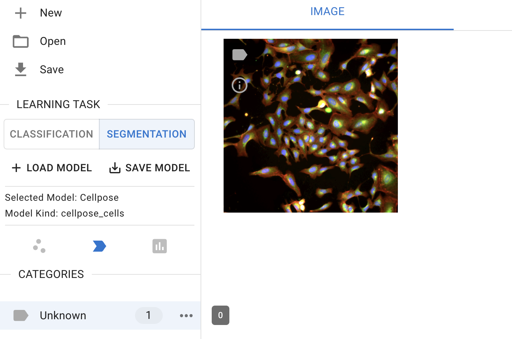
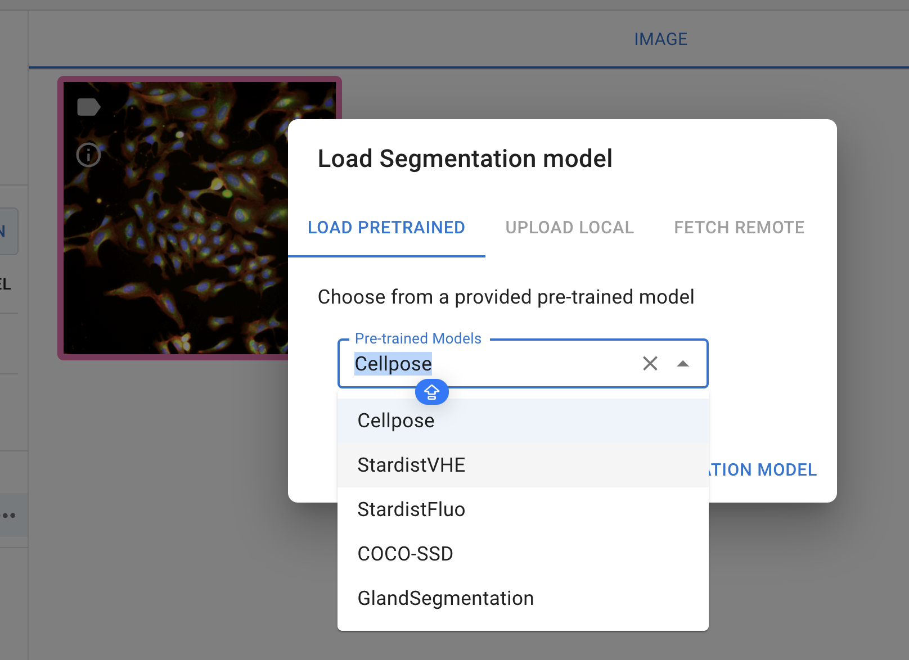
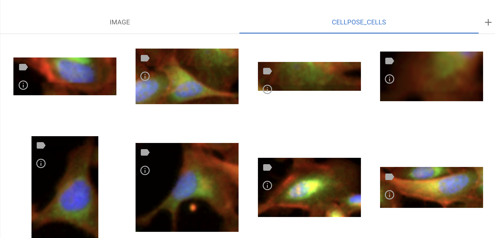

# Segmentation

# Image Segmentation

The image segmentation module allows researchers to quickly identify cells or nuclei by selecting pre-trained segmentation models. Users can choose a model from the available options and apply it to images that are opened and selected in Piximi for inference.

## 1. Load images

To begin, loading the images from an example dataset included in Piximi by pressing  `Open` in the top left. Select `Image` > `example image` > `U2OS cell-painting experiment ` to get started. Alternatively, if you would like to load your own images, press  `Open image` in the top right.

The images correspond to U2OS cells U2OS cells treated with an RNAi reagent
(https://portals.broadinstitute.org/gpp/public/clone/details?cloneld=TRCN0000195467) and stained for a cell-painting experiment. 

## 2. Load Models

Currently, the annotator provides five pre-trained models, each designed for specific segmentation tasks:

- **Cellpose**: A generalist algorithm for cellular segmentation and trained on fluorecence images
- **Stardistfluo**: Trained on fluorecence images, ideal for identifying objects with star-convex shapes
- **StardistVHE**: To identify nuclei in hematoxylin and eosin (H&E) stained image. 
- StardistFluo
- **COCO-SSD**: To identify objects in “natural images” (or photographs) of 80 different classes (such as humans and kites) using the COCO format
- **GlandSegmentation**: To segment intestinal glands trained on the Gland Segmentation in Colon Histology Images Challenge Contest (GlaS)29

In the 'Learning task' sub-menu on the left-hand side, click the 'Segmentation' button to switch the classification to cell segmentation.

*Segmentation interface*

Then, click the '+ Load Model' button to select a model. Currently, only the pre-trained model is available for selection. 

*Segmentation model selection*

Note: Cellpose is currently unique in that it runs on the AI4Life project’s BioEngine30 server while StarDist, like other Piximi models, runs client-only in the user’s own browser without data leaving their machine. 

Stay tuned for 'upload local' and fetch 'remote feaure'!

## 3. Run the model
click on  'predict model' to run the model you selected for the image selected for segmentation

*Model prediction*

## 4. Segmentation output

In this example, we use the Cellpose-Cell model to segment cells in the image. To view the segmented cells, switch the channels from 'Image' to 'Cellpose-Cell'  at the top center of the interface.

*Examples of segmentation output*

The outputs of the segmented objects can be used for downstream analysis, including annotations, measurements, and classifications.
