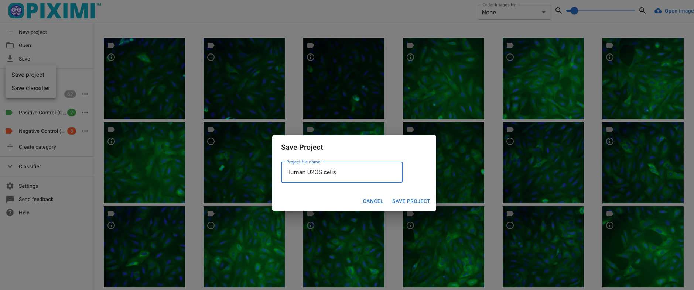
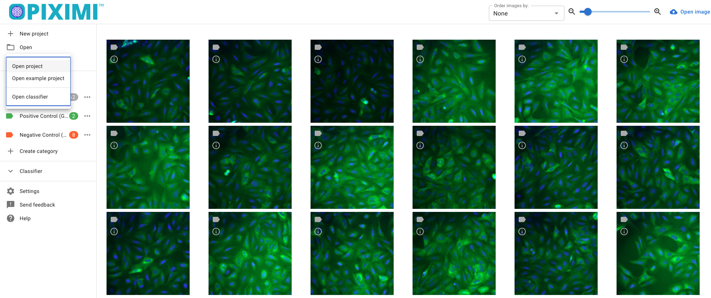
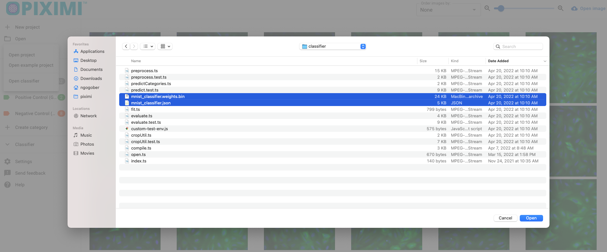

# Technical FAQ

- [If Piximi crashes, how can I recover my project?](#if-piximi-crashes-how-can-i-recover-my-project)
- [Can I run Piximi offline?](#can-i-run-piximi-offline)
- [Is there logging?](#is-there-logging)
- [What models are used?](#what-models-are-used)
- [What if I lose my internet connection while the model is training?](#what-if-internet-connection-is-lost-while-a-model-is-training)
- [Is it possible to see a training summary?](#is-it-possible-to-see-a-training-summary)
- [Does Piximi use a GPU?](#does-piximi-use-a-gpu)
- [If I run Piximi multiple times, why do I get different traiing results?](#if-i-run-the-same-model-multiple-times-why-do-i-get-different-training-results)

## If Piximi crashes, how can I recover my project?

Currently, there is no mechanism to auto-save work. It is highly recommended to manually save work periodically as you go.

The "Save project" option will save the entire state of the project, including all images and annotations made on them, and model settings (preprocessing, architecture, optimization, and dataset settings), but not including the trained model weights.

To save the trained model weights, use the "Save classifier" option.

If Piximi crashes, reload your work by using the "Open project" option to load images and project settings.

Use the "Open classifier" option to load a trained model and its parameters.

Make sure to select both the weights (model paramaters) bin file and json (model architecture) file.

## Can I run Piximi offline?

Yes. Once you visit the application, there is no need for an internet connection so long as you do not close or refresh the tab. If you close or refresh the tab, you will need an internet connection to reload Piximi.

You can also serve the application locally using Docker. The instructions to do this are on the [main Piximi repo README](https://github.com/piximi/piximi#docker). After downloading the source code, no internet connection is necessary for serving locally and using the app.

No internet connection is necessary to save or load projects and models.

## Is there logging?

No. Piximi does not log any information, perform any telemetry, or make any external API calls.

## What models are used?

SimpleCNN, which uses 2 convolutional layers, 2 max pooling layers, and 1 dense layer. All layers are initialized with random weights and the entire model is trained.

[MobileNetV1](https://github.com/tensorflow/models/blob/master/research/slim/nets/mobilenet_v1.md) (specifically, `MobileNet_v1_0.25_224`), which is a model pre-trained for image classification. Only the final convolutional layer's parameters are modified during training, the rest of the parameters in the model are frozen.

## What if internet connection is lost while a model is training?

Once Piximi is loaded, no internet connection is necessary. You may keep working, save your project and model, and load previously saved projects and models. If you close the tab containing Piximi, or hit refresh on the browser, you will need an internet connection to reload Piximi.

No internet connection is necessary to save or load projects and models.

## Is it possible to see a training summary?

Yes. The model summary, accuracy and loss are displayed in the Classifier dialog, and will remain there even if you leave the dialog and re-enter.

Additional metrics are available via the Evaluation dialog.

If a new model is trained however, or if the current model is re-trained, these will be lost. To avoid this, save the current model before performing any additional training.

## Does Piximi use a GPU?

Yes. Piximi uses Tensorflow.js which in turn uses [WebGL](https://en.wikipedia.org/wiki/WebGL).

If using Chrome, users will need to enable GPU use by going into preferences -> advanced -> system, and enabling the "Use hardware acceleration when available" option.

## If I run the same model multiple times, why do I get different training results?

It is possible to get different training results when training on the same data. There are two major reasons for this: the first is a result of the random validation dataset that is selected by Piximi when you press  `Fit Classifier`. For example, the first time you fit the classifier, images 1, 2 and 3 may be selected for the validation dataset. A second, and identical, run of fit classifier might then select images 4, 5 and 6 as your validation dataset, which look different to the images selected in the first run. Validation image selection is random so that the model performance can be evaluated independently of the images selected for validation. Even if your validation data set were identical, however, your results may still end up slightly different run-to-run due to certain steps in the training process that draw on random numbers and/or shuffle the data; we do not currently but may in the future provide ways to stabilize these parameters across runs. 

Given these considerations, please do save your models frequently if you think they are performing well - you can always delete an old model later, but a generated model cannot be sure to be generated again if it hasn't been saved!
