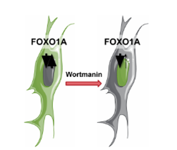
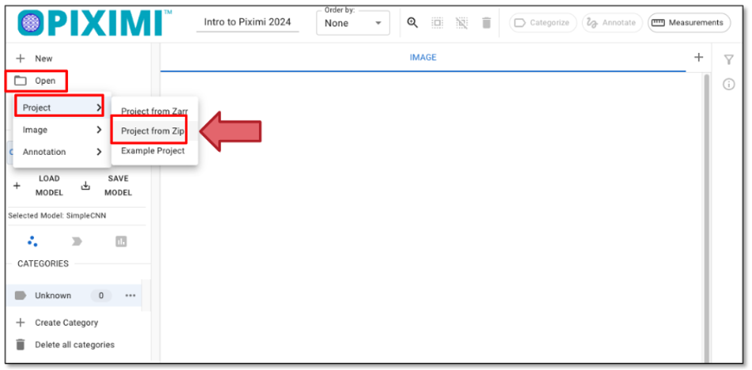
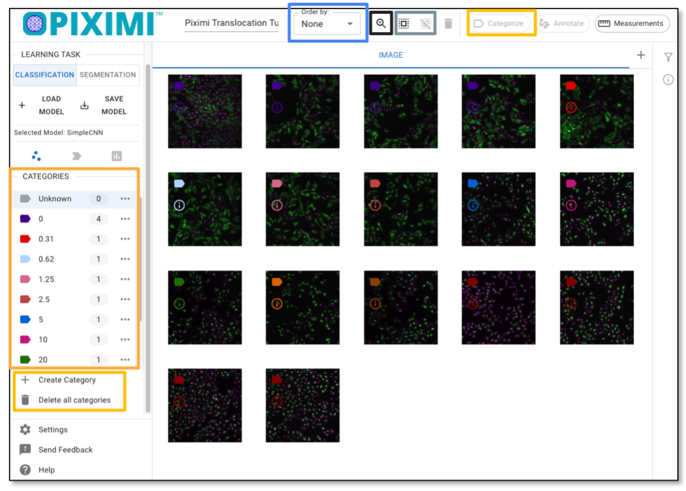
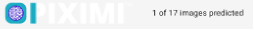
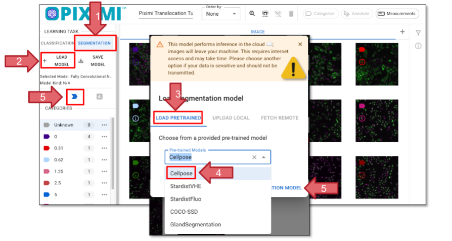
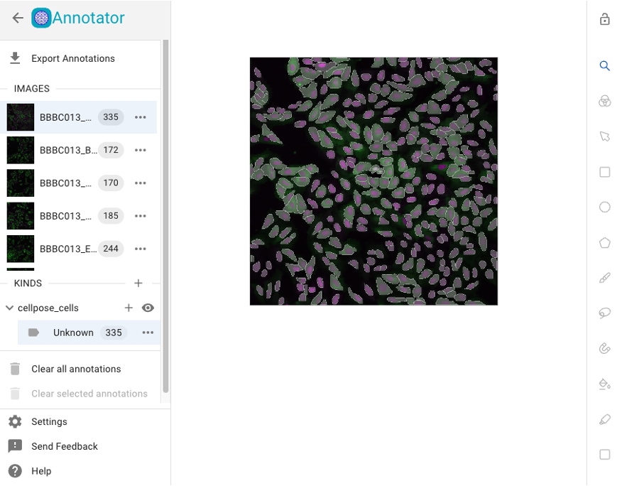
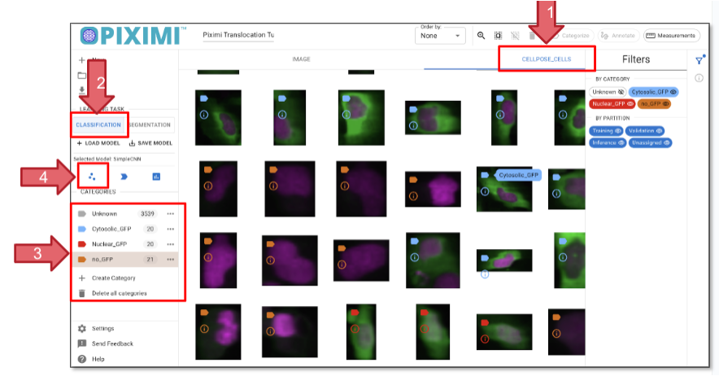
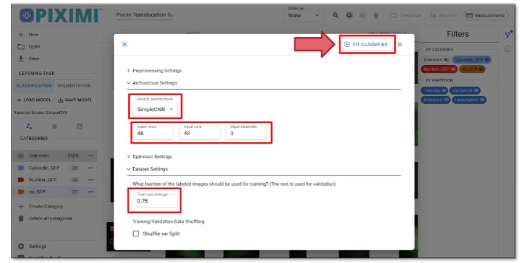
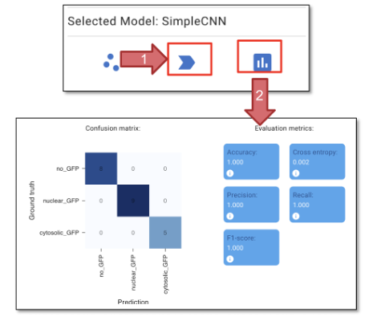
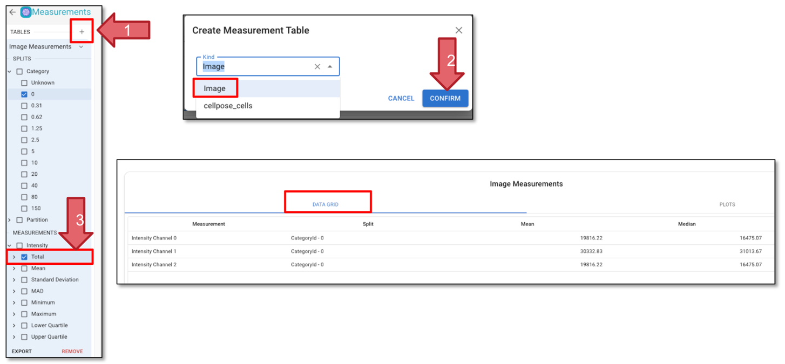

# Piximi: Installation-free segmentation and classification in the browser

## A computer exercise using webtool \- Piximi

Beth Cimini, Le Liu, Esteban Miglietta, Paula Llanos, Nodar Gogoberidze

Broad Institute of MIT and Harvard, Cambridge, MA.

### **Background information:**

#### **What is Piximi?**

Piximi is a modern, no-programming image analysis tool leveraging deep learning. Implemented as a web application at [https://piximi.app/](https://piximi.app/), Piximi requires no installation and can be accessed by any modern web browser. Its client-only architecture preserves the security of researcher data by running all\* computation locally. 

Piximi is interoperable with existing tools and workflows by supporting import and export of common data and model formats. The intuitive researcher interface and easy access to Piximi allows biological researchers to obtain insights into images within just a few minutes. Piximi aims to bring deep learning-powered image analysis to a broader community by eliminating barriers to entry. 

\* except for the segmentations using Cellpose, which are sent to a remote server (with the permission of the user).

Core functionalities:  **Annotator, Segmentor, Classifier, Measurments.** 

#### **Goal of the exercise**

In this exercise, you will familiarize yourself with Piximi’s main functionalities of annotation, segmentation, classification, measurement and visualization and use it to analyze a sample image dataset from a translocation experiment. The goal of this experiment is to determine the **lowest effective dose** of Wortmannin required to induce GFP-tagged FOXO1A nuclear localization (Figure 1\)**.** You will segment the images using one of the deep learning models available in Piximi, check and curate the segmentation, then train an image classifier to classify the individual cells as having “nuclear-GFP”, “cytoplasmic-GFP” or “no-GFP”. Finally, you will make measurements and plot them to answer the biological question.

#### **Context of the sample experiment**



In this experiment, researchers imaged fixed U2OS osteosarcoma (bone cancer) cells expressing a FOXO1A-GFP fusion protein and stained DAPI to label the nuclei. FOXO1 is a transcription factor that plays a key role in regulating gluconeogenesis and glycogenolysis through insulin signaling. FOXO1A dynamically shuttles between the cytoplasm and nucleus in response to various stimuli. Wortmannin, a PI3K inhibitor, can block nuclear export, resulting in the accumulation of FOXO1A in the nucleus.  


```{figure} ./img/tutorial_images/Figure1.png
:width: 300
:align: center

**Figure 1**: Schematic representation of FOXO1A mechanism
```


#### **Materials necessary for this exercise**

The materials needed in this exercise can be downloaded from: [PiximiTutorial](./downloads/Piximi_Translocation_Tutorial_RGB.zip). The “Piximi Translocation Tutorial RGB.zip” file contains a Piximi project, including all the images, already labeled with the corresponding treatment (Wortmannin concentration or Control). Download this file but **do NOT unzip it**\! 

#### **Exercise instructions**

Read through the steps below and follow instructions where stated. Steps where you must figure out a solution are marked with 🔴 TO DO.

1. ##### **Load the Piximi project**

🔴 TO DO

* Start Piximi by going to:[https://piximi.app/](https://piximi.app/)

* Load the example project:  Click “Open” \- “Project” \- “Project from Zip”, as shown in figure 2 to upload a project file for this tutorial from Zip, and you can optionally change the project name in the top left panel, such as “Piximi Exercise”. As it is loaded, you can see the progression in the top left corner logo . 



2. ##### **Check the loaded images and explore the Piximi interface**

These 17 images represent Wortmannin treatments at eight different concentrations (expressed in nM), as well as mock treatments (0uM). Note the DAPI channel (Nuclei) is shown in magenta and that the GFP channel (FOXOA1) is shown in green. 

As you hover over the image, color labels are displayed on the left corner of the images. These annotations are from metadata in the zipped file we just uploaded. In this tutorial, the different colored labels indicate the concentration of Wortmannin, while the numbers represent the number of images in each category.

Optionally, you can annotate the images manually by clicking “+ Category”, entering your label, and then selecting the image by clicking the images annotating the selected images by clicking **“Categorize”**. In this tutorial, we’ll skip this step since the labels were already uploaded at the beginning.




3. ##### **Segment Cells \- find out the cells from the background**

 🔴 TO DO

* To start the prediction on all images, click “Select All Images” in the top panel as shown in Figure 3\.   
* Change the Learning Task to “SEGMENTATION” (Figure 4, Arrow 1).

*  Click on “+ LOAD MODEL” (Arrow 2\) and the window will pop up, allowing you to choose a pretrained model (Arrow 3). For today’s exercise, select “Cellpose” (Arrow 4).  More information about the model supported can be found [here](https://documentation.piximi.app/segmentation.html).  
* Click “Open Segmentation Model” (Arrow 5\) to load your model and select it. Finally, click “Predict Model” (Arrow 5). You’ll see the prediction progress displayed in the top left corner beneath the Piximi logo . 
* It will take a few minutes to finish the segmentation. 





Please note that the previous steps were performed on your local machine, meaning your images are stored locally. However, Cellpose inference runs in the cloud, which means your images will be uploaded for processing. If your images are highly sensitive, please exercise caution when using cloud-based services.

4. ##### **Visualize segmentation result and fix the segmentation errors**

🔴 TO DO

* Click on the **CELLPOSE\_CELLS** tab to check the individual cells that have been segmented Click on the “IMAGE” tab and then “Annotate”, you can check the segmentation on the whole image.



* Optionally, here you can manually refine the segmentation using the annotator tools. The Piximi annotator provides several options to **add**, **subtract**, or **intersect** annotations. Additionally, the **selection tool** allows you to **resize** or **delete** specific annotations. To begin editing, select specific or all images by clicking the checkbox at the top.  
* Optionally, you can adjust channels: Although there are two channels in this experiment, the nuclei signal is duplicated in both the red and green channels. This design is intended to be **color-blind friendly** and to produce a **magenta color** for nuclei. The **green channel** also includes cytoplasmic signals.

Another reason for duplicating the channels is that some models—such as the **Cellpose model** we used today—require a **three-channel** input. 

* You can choose to manually segment the cells to generate masks for ground truth data. 

5. #####   **Classify cells** 

Reason for doing this: We want to classify the 'CELLPOSE\_CELLS' based on GFP distribution (on Nuclei, cytoplasm, or no GFP) without manually labeling all of them. To do this, we can use the classification function in Piximi, which allows us to train a classifier using a small subset of labeled data and then automatically classify the remaining cells.

 🔴 TO DO

* Go to the **CELLPOSE\_CELLS** tab that displays the segmented objects (arrow 1, figure 6\)  
* Click on the **Classification** tab on the left panel (arrow 2, figure 6).  
* Create new categories by clicking **“+ Category”**. Adding “Cytoplasmatic\_GFP”, “Nuclear \_GFP”, “No GFP” three categories (Arrow 3, Figure 6).  
* Click on the images that match your criteria. You can select multiple cells by holding **Command (⌘)** on Mac or **Shift** on Linux. Aim to assign **\~20–40 cells per category**. Once selected, click **“Categorize”** to assign the labels to the selected cells.



6. ##### **Train the Classifier model**

 🔴 TO DO

* Click the ” - fit model” icon to open the model hyperparameter settings. For today’s exercise, we’ll adjust a few parameters:  
* Click on “Architecture Settings” and set the Model Architecture to SimpleCNN.  
* Update the Input Dimensions to:  
  - Input rows: 48   
  - Input cols: 48  
  - Channels: 3 (since our images are in RGB format)  

  (You can change to other numbers such as 64, 128)




* Click on the “Dataset Setting” tab and set the Training Percentage to 0.75, which reserves 25% of the labeled data for validation.  
* When you click **"Fit Classifier"** in Piximi, two training plots will appear “**Accuracy vs Epochs”** and **“Loss vs Epochs”**. Each plot shows curves for both **training** and **validation** data.  
* In the **accuracy plot**, you’ll see how well the model is learning. Ideally, both training and validation accuracy should increase and stay close.  
* In the **loss plot**, lower values mean better performance. If validation loss starts rising while training loss keeps dropping. g, the model might be overfitting.

These plots help you understand how the model is learning and whether adjustments are needed.

7. ##### **Evaluate model:**

 🔴 TO DO



* Click **“Predict Model” (figure 8, arrow 1\)**  to apply the model we just trained. This step will generate predictions on the cells we did not annotate.    
* You can review the predictions in the CELLPOSE\_CELLS tab and delete any wrongly assigned categories.  
* Optionally, you can continue using the labels to refine the ground truth and improve the classifier. This process is part of the **Human-in-the-loop classification**, where you iteratively correct and train the model based on human   input.  
* Click **“Evaluate Model” (figure 8, arrow 2\)** to evaluate the model we just trained. The confusion metrics and evaluation metrics can be compared to the ground truth.  
* Click "Accept Prediction (Hold)”, to assign the predicted labels to all the objects.

8. ##### **Measurement**

Once you are satisfied with the classification, we will proceed to measure the objects. The goal of today’s exercise is to determine the minimum concentration of Wortmannin required to block the export of FOXO1A-GFP from the nuclei. To do this, we can measure the total GFP intensity at either the image level or the object level.

 🔴 TO DO

* Click “Measurement” in the top right corner.  
* Click Tables (Arrow 1\) and select Image and click “Confirm” (Arrow 2).  
* Choose "MEASUREMENT" in the left panel, note the measurement step may take some time to process.  
* Click on 'Category' to include all categories in the measurement.  
* "Under 'Total', click on 'Channel 1' (Arrow 3\) to select the measurement for GFP. You will see the measurement in the “DATA GRID” tab.  Measurements are presented as either mean or median values, and the full dataset is available upon exporting the .csv file.




9. ##### **Visualization**

After generating the measurements, you can plot the measurements.

 🔴 TO DO

* Click on 'PLOTS' (Arrow 1\) to visualize the measurements.  
* Set the plot type to 'Swarm' and choose a color theme based on your preference.  
* Select 'Y-axis' as 'intensity-total-channel-1' and set 'SwarmGroup' to 'category'; this will generate a curve showing how GFP intensity varies across different categories (Arrow 2).  
* Selecting 'Show Statistics' will display the mean, as well as the upper and lower quality bounds, on the plot.   
* Optionally, you can experiment with different plot types and axes to see if the data reveals additional insights.


10. #####  **Export results and save the project** 

 🔴 TO DO

* Click “SAVE” in the top left corner to save the entire project. You'll see the Piximi logo animation as the save progresses . 

11. #####  **Supporting Information**

Check out the Piximi paper:  [https://www.biorxiv.org/content/10.1101/2024.06.03.597232v2](https://www.biorxiv.org/content/10.1101/2024.06.03.597232v2)

Check out the Piximi documentation:[Piximi documentation](https://documentation.piximi.app/intro.html):[https://documentation.piximi.app/intro.html](https://documentation.piximi.app/intro.html)

Report bugs/errors or request features [https://github.com/piximi/documentation/issues](https://github.com/piximi/documentation/issues)
